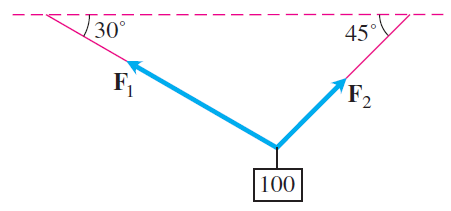

# Homework 1
## Due: January 22, 2018, 8 a.m.

Please give a complete, justified solution to each question below. A single-term answer without explanation will receive no credit. 

Please complete each question on its own sheet of paper (or more if necessary), and upload to [Gradsescope](https://gradescope.com/).

$$
\newcommand{\R}{\mathbb{R}}
\newcommand{\dydx}{\frac{dy}{dx}}
\newcommand{\proj}{\textrm{proj}}
% For boldface vectors:
\renewcommand{\vec}[1]{\mathbf{#1}}
$$

1\.&nbsp;&nbsp; a\. Let $\mathcal{S}$ be the solid region first octant bounded by the coordinate planes and the planes $x = 3$, $y = 3$, and $z = 4$  (including points on the surface of the region). Sketch, or describe the shape of the solid region $\mathcal{E}$ consisting of all points that are at most 1 unit of distance from some point in $\mathcal{S}$. Also find the volume of $\mathcal{E}$.

&nbsp;&nbsp; b\. Write an equation that describes the set of all points that are equidistant from the origin and the point $(2, -1, -2)$. What does this set look like?

2\. Consider the points $A = (0, -3, -1)$ and $B = (1, 2, -2)$.  Let $O$ denote the origin, $(0, 0, 0)$.

&nbsp;&nbsp; a\.  Let $M$ denote the midpoint of the line segment $\overline{AB}$.  Find the vector $\overrightarrow{OM}$.

&nbsp;&nbsp; b\. Let $N$ denote the point on the line segment $\overline{AB}$, whose distance from $A$ is a quarter of the distance between $A$ and $B$.  Find the vector $\overrightarrow{ON}$.

3\. Consider the vectors $\mathbf a = \langle 3, 2\rangle$ and $\mathbf b = \langle 2, -1\rangle$.

&nbsp;&nbsp; a\. Draw the vectors: (i) $0.5 \mathbf a + 0.5 \mathbf b$; (ii) $2 \mathbf a - \mathbf b$; and (iii) $1.5 \mathbf a - 0.5 \mathbf b$.
    
&nbsp;&nbsp; b\. Choose any two scalars $s$ and $t$ that add up to 1.  Then, draw the vector $s \mathbf a + t\mathbf b$.  (Choose $s$ and $t$ so that the resulting vector is different from any of the vectors in part (a)).

&nbsp;&nbsp; c\.Describe what you observe from parts (a) and (b).  That is,
	describe the vectors obtained by adding $s$ times $\mathbf a$ and $t$ times $\mathbf b$, whenever $s + t = 1$.
    
&nbsp;&nbsp; d\. Describe the vectors obtained by adding $s$ times $\mathbf a$ and $t$ times $\mathbf b$, whenever $s + t = 1$ and $s$ and $t$ are nonnegative.

4\. Find the vectors whose lengths and directions are given:
\begin{enumerate}

&nbsp;&nbsp; a\.length = $\frac{1}{\sqrt{14}}$, direction = $-3 \mathbf i + 2 \mathbf j + \vec k$
    
&nbsp;&nbsp; b\. length = $\frac{13}{12}$, direction = $\frac{3}{13} \mathbf i - \frac{12}{13} \mathbf j + \frac{4}{13} \mathbf k$

5\. Compute the scalar triple product $\mathbf u \cdot (\mathbf v \times \mathbf w)$, where $\mathbf u, \mathbf v, \mathbf w$ are as follows:
	\begin{eqnarray*}
	\mathbf u & = & 2\mathbf i - 2 \mathbf j + 4\mathbf k\\ 
	\mathbf v & = & 2\mathbf i +9 \mathbf j -\mathbf k \\
	\mathbf w & = & 4 \mathbf i + 7 \mathbf j + 3 \mathbf k.
	\end{eqnarray*}
Then, explain how you can tell that all three vectors lie on the same plane from the value of the scalar triple product that you computed above. (_Hint:_ What is $\mathbf u$ perpendicular to?)

6\. Suppose that $\mathbf u$ and $\mathbf v$ are nonzero vectors in $\mathbb{R}^3$.  Show that the vector $\mathbf u - \operatorname{proj}_{\mathbf v} \mathbf u$ is orthogonal to $\operatorname{proj}_\vec{v}\vec u$. 

**bonus** Use *this* result to find the point on the plane containing $(0,0,0)$, $(1,1,0)$, and $(0,1,1)$ that is closest to the point $(1,0,0)$.

7\. Consider a 100 Newton weight suspended by two wires as shown in the figure below.  Find the magnitudes and  the $\mathbf i$- and $\mathbf j$- components of the force vectors $\mathbf F_1$ and $\mathbf F_2$.

